# Hi, I'm xzh767 👋

**A student developer interested in web development, open-source projects, self-hosting and Internet infrastructure.**

## 🚀 What I'm working on

- 🎵 **[lxmusic-web-shell](https://github.com/xzh767/lxmusic-web-shell)** — a web frontend project exploring APIs, frontend development and deployment workflows
- ☁️ Exploring **Cloudflare, GitHub Actions, serverless deployment, APIs and self-hosting**
- 🖥️ Learning **Linux administration, Docker and real-world web infrastructure** through practical projects

## 🛠️ Things I like

`JavaScript` `TypeScript` `PHP` `HTML/CSS` `Node.js` `GitHub Actions` `Cloudflare` `Docker` `Linux`

## 📊 GitHub Stats

## 🐍 Contributions

### Thanks for visiting! ✨

